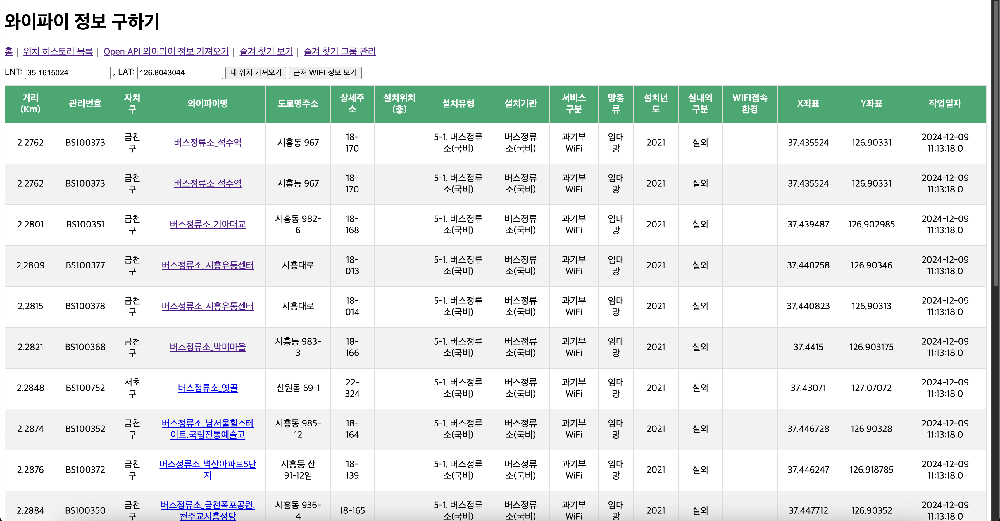
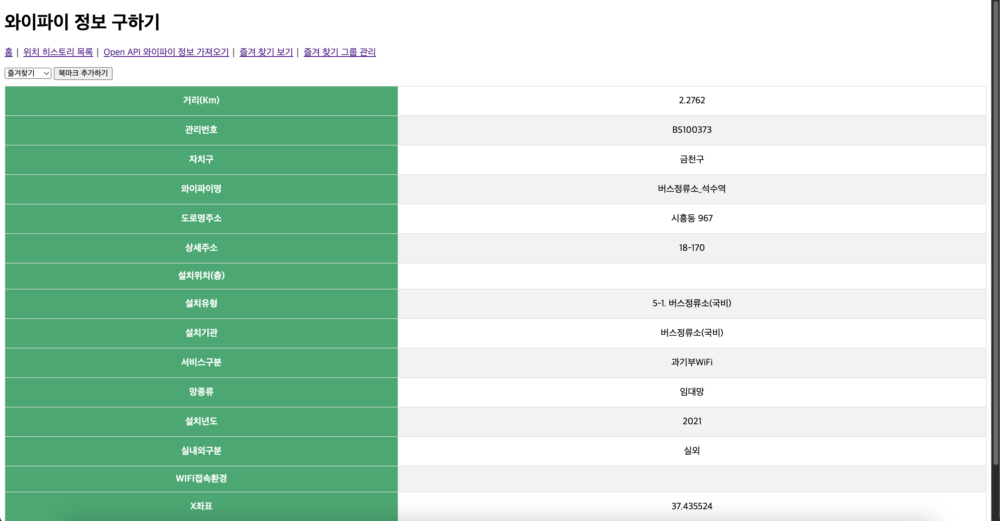
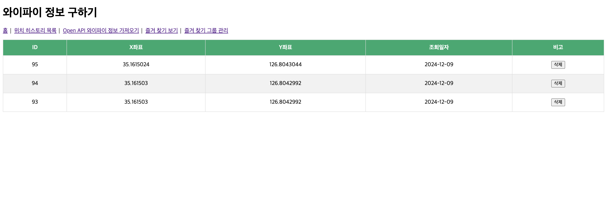
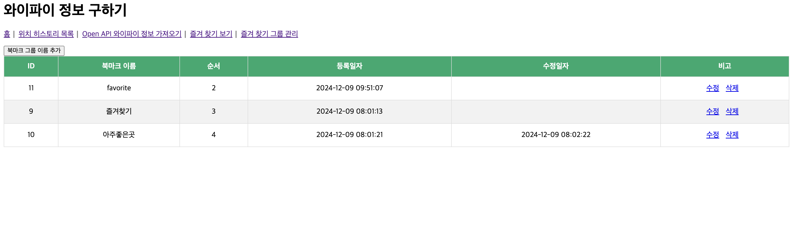
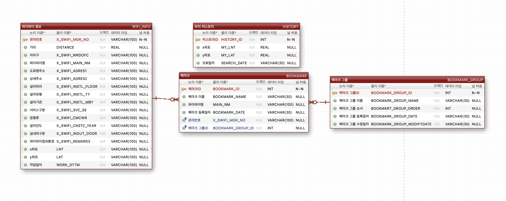

# Wifi-Project
내 위치를 기반으로 공공 와이파이 데이터를 검색, 저장하는 사이트
(서울시 오픈 API 사용)

## Project Info
### 사용 기술
- Java (openjdk 22.0.1)
- Jsp
- maven
- SQLite
- gson
- tomcat v8.5

### 프로젝트 기능
- Open API 와이파이 정보 가져오기

- 가져온 정보를 gson을 사용해 파싱, SQLite DB에 저장
- JavaScript로 현재 위치 가져오기
- 가져온 와이파이 정보에서 현재 위치와 가까운 20개의 데이터 출력

- 와이파이 상세 정보 보기

- 가까운 와이파이 정보 검색 시 위치 히스토리 등록

- 북마크 그룹, 북마크 추가 기능

## ERD

## 트러블슈팅

### SQLlte [SQLITE_BUSY] The database file is locked (database is locked)
DB에서 쿼리 실행 후 종료시키지 않은 채로 쿼리를 다시 실행 할 때 발생하는 오류. Connection, PreparedStatement, ResultSet 사용 후 객체를 반드시 닫아줘야한다. 

try {} catch {} 구문 안에서 커넥션을 사용했는데, 그 바깥에서 close()를 시켰다가 제대로 닫히지 않았다. finally {} 구문을 뒤에 붙여서 그곳에서 닫아줘서 해결